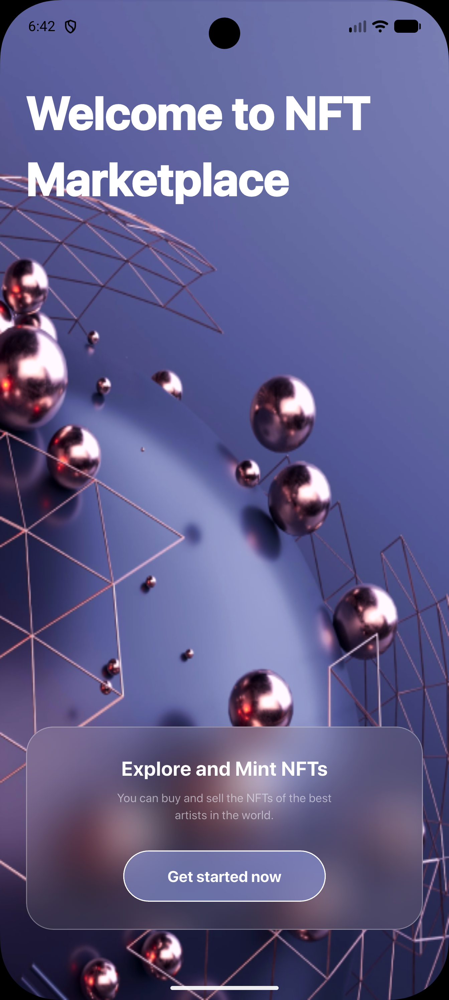

# 🎨 Mini NFT Marketplace UI - Flutter Concept

Welcome to the **Mini NFT Marketplace** project! This is a specialized UI exploration where I push the boundaries of modern mobile design using **Flutter**. The goal is to create a seamless, visually stunning experience for digital art enthusiasts, focusing on high-end aesthetics like **Glassmorphism**, vibrant gradients, and a deep dark-mode interface.

---

## 📸 App Preview

To give you a glimpse of the visual journey, here is the current progress of the application's interface:

<table style="width:100%; border-collapse: collapse; border: none;">
  <tr>
    <td align="center" style="border: none;">
      <p><b>1. Onboarding Screen</b></p>
      
    </td>
    <td align="center" style="border: none;">
      <p><b>2. Home Feed (Coming Soon)</b></p>
      
    </td>
    <td align="center" style="border: none;">
      <p><b>3. Stats & Ranking (Coming Soon)</b></p>
      
    </td>
  </tr>
</table>

> **Note:** Make sure to place your screenshots in a folder named `screenshots` in the root directory for them to appear here!

---

## 💡 Design Philosophy & Motivation

As a Flutter developer, I’ve always been fascinated by how a digital product _feels_. This project wasn't just about building "another app"; it was a challenge to:

- **Master Glassmorphism:** Implementing blurred backgrounds and semi-transparent layers that look natural and premium.
- **Precision Typography:** Using a clean hierarchy to ensure readability even with complex backgrounds.
- **Custom Navigation:** Designing a bottom navbar that doesn't just function but adds to the overall "vibe" of the app.

---

## 🛠️ Technical Deep Dive

This project is built with a focus on clean code and performance:

- **Framework:** [Flutter](https://flutter.dev/) - For its unmatched UI flexibility.
- **State Management:** Planned implementation of _Provider_ or _Bloc_ for seamless data flow.
- **Custom Painters:** Used for those tricky background shapes and unique UI elements.
- **Responsiveness:** Carefully calculated layouts to ensure the UI looks perfect on various screen sizes (using `MediaQuery` and `LayoutBuilder`).

---

## 🚀 Roadmap (Current Progress)

- [x] **Phase 1: The First Impression**
  - High-fidelity Onboarding screen implementation.
  - Glassmorphic "Get Started" button with custom blur effects.
  - Integration of 3D-like background assets.

- [ ] **Phase 2: The Marketplace Hub**
  - Implement the "Trending Collections" horizontal scroll.
  - Create the "Top Seller" grid with hover-like animations.
  - Build the custom floating action button navigation.

- [ ] **Phase 3: Data & Stats**
  - Interactive ranking list with price movement indicators (Green/Red percentages).
  - Filtering system (All categories / All chains).

---

## ⚙️ How to Run Locally

1. **Clone the repo:**
   ```bash
   git clone [https://github.com/Ziad-Yaseen/mini_nft_marketplace.git](https://github.com/Ziad-Yaseen/mini_nft_marketplace.git)
   ```
